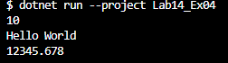

## 3
## สามารถ builtได้ เพราะprintใน Class Generic ซึ่งเป็น Generic method ซึ่งรับพารามิเตอร์ชนิดข้อมูล T และพารามิเตอร์

## 5
## Run ได้ เพราะ System.Console.WriteLine() โดยใช้ค่าของพารามิเตอร์ T ที่รับเข้ามาในmethod ซึ่งในที่นี้จะถูกแทนที่ด้วยค่าที่เราส่งเข้ามาเมื่อเรียกใช้ Print ในโปรแกรมหลัก
